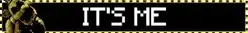

  
about me

  hihi! im nero!! ^_^

  bpd willosys host - NOT sys creator
 
  agefluid, bodily 18

  i use meow/meowself and he/him pronouns + masc terms

  catgender, fictoromantic/sexual

  bpd, asd, adhd, ocd, gad, cptsd

  
stances/dni

  i have no dni. i will simply ignore you if i dont like you. follow your own dni and block me if you dont agree with/tolerate my stances below!

  stances:

  { profic

  proship

  pro lolisho

  prokink

  pro paras

  pro all good faith identities

  pro contradictory labels

  neu transid

  neu endo/willo/tulpa

  neu da/irl

  anti radqueer

  anti pro-c/anti-rec harmful paras (pedos, zoos, necros etc)

  anti harmful transids (transrace, transabled, transage who dont disclose bodily age)

  anti censorship

  anti harassment }

  specifically syscourse dni, and dni if you harass ***anyone*** over ***anything***

  minors iwc and under 16 preferably do not friend

  also i know a lot of people have me blocked, so for those who dont, id like to know if i were sitting on someone, or if someone was sitting on me ^^"
  

 

important

i am diagnosed with [bpd](https://bpdresources.carrd.co/). this affects every aspect of my relationships with people. we recently had an extreme bpd episode and lost a lot of friends. were still recovering. im extremely paranoid at the moment and am struggling to continue connecting with people after that. interact with EXTREME caution and avoid confrontation as much as possible. im willing to talk to and be friendly with people but im terrified of getting *too close* to anyone for the time being.

also irl stuff is shit and system stuff is a LOT right now, so we wont be NEARLY as active on pony town and online in general as we used to be. (used to have sup t4 and sit afk 24/7 :'3 ~~i miss my supporter~~)

also *also*! i unfortunately may have to clarify this, but if there are any *genuine* pedophile allegations against *anyone* in our system, they are NOT true?? NONE of us are pedophiles. i apologize sincerely on the behalf of any of our system members who may have hurt anyone. the past few months have been a very complicated time for us and we may have acted very much in the wrong. but that does not excuse any problematic behavior from us. thank you for reading and PLEASE dont spread rumors just because we are proship!

11/23/25

