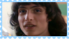
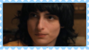
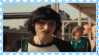
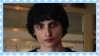
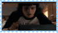

profile formatting may be messed up on mobile!

  

  
about me

  hihi! im nero!! ^_^

  bpd willosys host - NOT sys creator
 
  agefluid, bodily 18

  i use paw/pawself and he/him pronouns + masc terms

  demiboy + xenogenders, fictoromantic/sexual ONLY. i do not experience attraction to real people

  shotacon and dark/comshipper

  bpd, asd, adhd, ocd, gad, cptsd

  special interest: five nights at freddys ; current interest: stranger things/byler

  
stances/dni

  i have no dni. i will simply ignore you if i dont like you. follow your own dni and block me if you dont agree with/tolerate my stances below!

  stances:

  { profic

  proship

  pro lolisho

  prokink

  pro paras

  pro all good faith identities

  pro contradictory labels

  neu transid

  neu endo/willo/tulpa

  neu da/irl

  anti radqueer

  anti pro-c/anti-rec harmful paras (pedos, zoos, necros etc)

  anti harmful transids (transrace, transabled, transage who dont disclose bodily age etc)

  anti censorship

  anti harassment }

  specifically syscourse dni, and dni if you harass ***anyone*** over ***anything***

  minors iwc and under 16 preferably do not friend

  also i know a lot of people have me blocked, so for those who dont, id like to know if i were sitting on someone, or if someone was sitting on me ^^"
  

 

important

i am diagnosed with [bpd](https://bpdresources.carrd.co/). this affects every aspect of my relationships with people. read the linked carrd and educate yourself before trying to get close. i am mentally ill and very very paranoid, jealous and selfish, and im afraid i may be manipulative. interact with caution at all times. i would say more, but this section would get too long if i did. please just read the carrd, or if youre feeling lazy, at least check out the [glossary.](https://bpdresources.carrd.co/#glossary) dont interact with me if you cant bother to read a little to understand why i may act the way i do.

i am the host of a willogenic system, formed through [tulpamancy](https://tulpas.carrd.co/). i am NOT the system creator. i am NOT pro-endo or anti-endo. i want to stay out of "syscourse" - i dont want to get in arguments about whether im allowed to exist or not. if you are "anti-endo", just dont interact with me. i cannot stress how much i hate "syscourse" or how insulting it is. we are not a disordered system and we dont know what its like to be you, but you dont know what its like to be us, either. so dont assume.

i am [proship](https://proshipresourcesaccessible.carrd.co/), among other things. our system is collectively profic. i am personally a darkshipper and shotacon. ill say one thing: i have never felt safer and more loved and accepted in a community than in the proship community. we arent creeps, we arent weirdos. we are people who want to enjoy tabboo fiction and have every right to do so. antis educate yourselves before interacting with me, or you give me no reason to even consider listening to you. (also please check out the linked carrd! it was made by a very awesome and respectable person and took a lot of time and effort to make!)

  
who's fronting?

frequent fronters who are active online/on pt

nero 🐾

charlie 🎁/🎂

  

  

  

 byler graphic by [@The-Forest-Syst3m](https://github.com/The-Forest-Syst3m)!!! thank yeww, much love <3 /p . art by @panasonicbf on pinterest 

